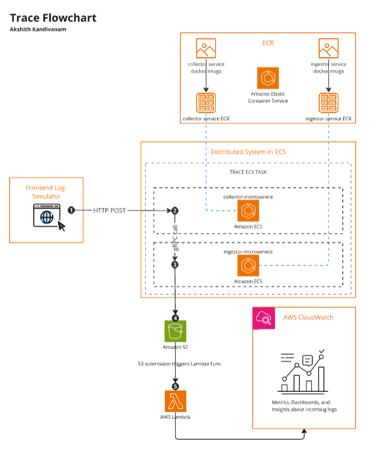

# Trace

A proof-of-concept log monitoring solution built with a microservices architecture and containerization, designed to capture logs from a live application acting as the log simulator. This solution delivers actionable insights through dashboards, counters, and detailed metrics based on the generated logs. Think of it as a very lightweight internal tool for monitoring logs in real-time.

## Motivation 🧠:

Why is a concept like **Trace** important? In a production environment, logs are generated at a high rate. These logs contain valuable information that can be used to identify and resolve issues in real-time. However, the sheer volume of logs can make it difficult to identify patterns and trends. **Trace** aims to solve this problem by capturing logs and providing actionable insights to developers and operators.

In production, **Trace** would be a standalone service that can be integrated into any application. It would be responsible for capturing logs and providing crucial insights to developers and operators -- insights that can be used to identify and resolve issues in real-time.

## Architecture 🏗️:

This software for this project can be broken down into three main components, with all the core infrastructure (e.g., ECS, ECR, S3, Lambda, CloudWatch, Subnets, VPCs, etc...) deployed on AWS via Terraform.

**1. Application Simulator**: 

A simple web-application that is able to generate logs at a high rate. This application simulates a real-world scenario where Common Log Format (CLF) logs are generated continuously.

- To create this web-application for simulating the log generation process, a simple React application was built, and sent the generated logs to the public-IP exposed by the collector service's container deployed in the cloud. Deployed the application simulator on Vercel.

**2. Deployed Microservices**:

Two microservices written in **GoLang** are responsible for capturing logs and initializing the log processing pipeline respectively. These microservices are: `collector` and `ingestor`

- **Collector**: This microservice is responsible for capturing logs from the application simulator and extracting the relevant information. It then forwards this information to the ingestor service via gRPC. The collector service is deployed as a container (pulls its respective Docker image from ECR) in the cloud and listens for incoming logs on a specific port -- orchestrated with AWS ECS.

- **Ingestor**: This microservice is responsible for initializing the log processing pipeline. It receives logs from the collector service and processes them, sends them to an S3 bucket for retention and further activation of the strategy. The ingestor service is also deployed as a container (pulls its respective Docker image from ECR) in the cloud (AWS ECS) and listens for incoming logs on a specific port.

**3. Serverless Functions + CloudWatch**:

Once the logs are sent to the S3 bucket, an AWS Lambda function is triggered. This Lambda function is responsible for processing the logs and generating actionable insights. The insights are then sent to CloudWatch for visualization with dashboards and counters.

## Flowchart 📊:

## Visuals 📸:

In the demo video below, we send a bunch of logs from the application simulator, which then get reflected in the CloudWatch dashboard I created, which shows the amount of CRUD operations performed in real-time. **Note:** I only created this one widget within the dashboard for the demo, but in a production environment, there would be multiple widgets within the dashboard showing different metrics and insights (e.g., histograms, time-series graphs, more counters, etc...).

Moreover, the link to the deployed log-simulator frontend can be found in this repository's description 'About' section. You can't expect to see any metric visualizations/dashboards whilst running the log simulator, as I've turned off the AWS infrastructure upon finishing the POC to save costs.

https://github.com/user-attachments/assets/c47cdbe5-84ce-42e6-a200-9691b73879ae

